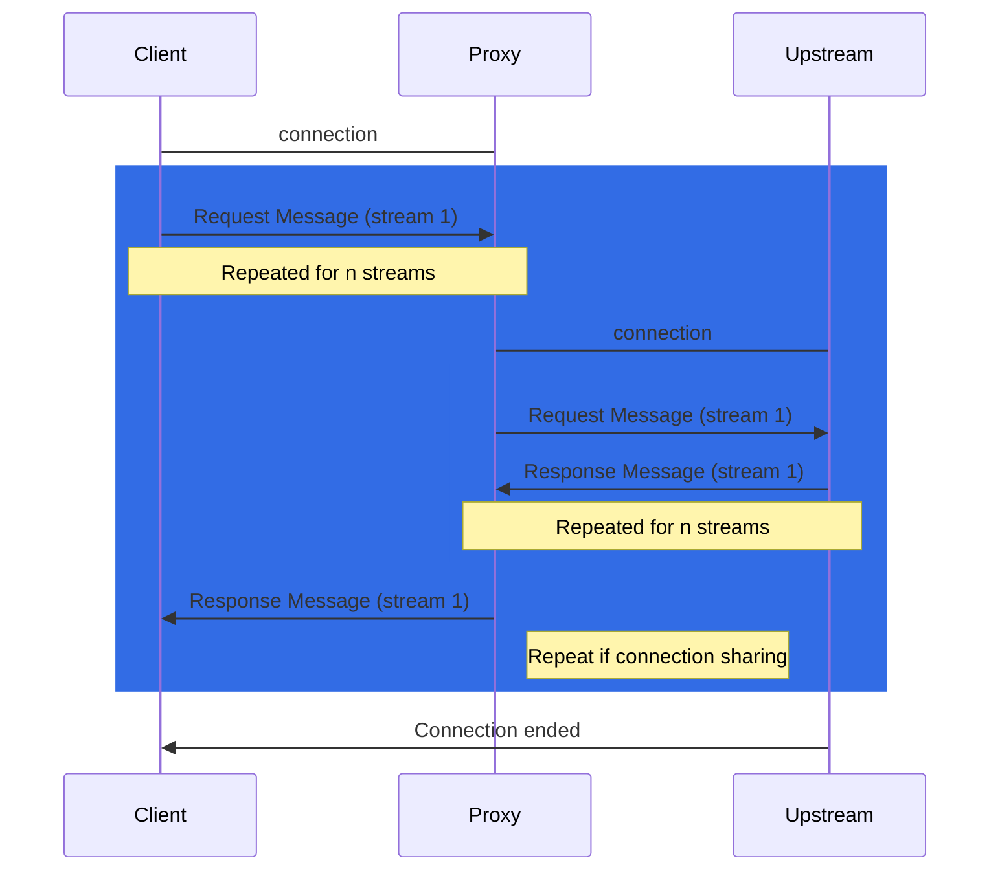
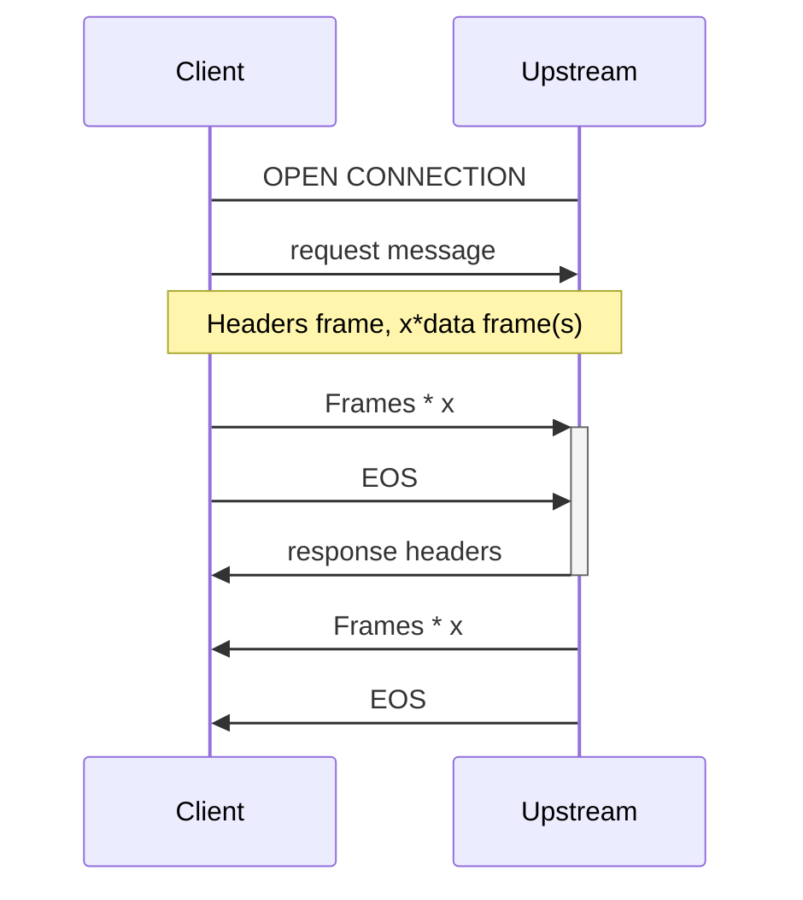

# GEP-3139: GRPCRoute Timeouts

* Issue: [#3139](https://github.com/kubernetes-sigs/gateway-api/issues/3139)
* Status: Implementable

(See status definitions [here](/geps/overview/#gep-states).)

## TL;DR

Similar to the HTTPRoute Timeouts ([GEP #1742](https://gateway-api.sigs.k8s.io/geps/gep-1742/)), the goal of this GEP is to create a design for implementing GRPCRoute Timeouts

## Goals
@arkodg (original requester of this experimental feature) had the following listed in the discussion, which is a good starting point the API of GRPCRoute timeouts

- The ability to set a request timeout for unary RPC
- The ability to set a request timeout for bidirectional streaming
- The ability to disable timeouts (set to 0s) for streaming RPC
- Define GRPCRoute timeouts in a manner supporting the semantics of the gRPC 

## Non-Goals

Define the overall structure of handling streaming for other routes. For example, we should look into streaming for HTTP, and update GEP 1742 as well.

## Introduction

This GEP intends to define timeout semantics that we can build into the Gateway API for GRPCRoute.

gRPC has the following 4 cases:
- Unary (single req, single res)
- Client Stream (Client sends a stream of messages, server replies with a res)
- Server Stream (Client sends a single req, Server replies with a stream)
- Bidirectional Streaming 

Read the [gRPC docs on more details](https://grpc.io/docs/what-is-grpc/core-concepts/#rpc-life-cycle)


Most implementations have a proxy for gRPC to implement Gateway API, as listed in [GEP 1742](https://gateway-api.sigs.k8s.io/geps/gep-1742/#background-on-implementations). Implementations rely on either Envoy, Nginx, F5 BigIP, Pipy, HAProxy, Litespeed, or Traefik as their proxy. 

Below is a sequence diagram of the timeouts from a client (outside the cluster), to the gateway (a proxy implementation), then to a service over an HTTP/2 connection:


Multiple streams share the same connection, and depending on if a unary request/response or a stream request/response is sent, theflow of messages may be independent of each other. 
Note that streams don't have to flow in order. The Proxy or Upstream can choose to send back its intial metadata _or_ wait for for the client to start streaming messages. 

Below is a high level sequance diagram of a HTTP/2 stream connection that occurs between a client and upstream:



Some differences from HTTPRoute timeouts

Noted by [@gnossen](https://github.com/kubernetes-sigs/gateway-api/discussions/3103#discussioncomment-9732739), the timeout field in a bidirectional stream is never complete, since the timer only starts after the request is finished, since the timer is never started. Envoy uses the config `grpc_timeout_header_max` in order to start the timer from when the first request message is initiated. 

Nginx uses grpc_<>_timeout is used to configure of gRPC timeouts, which occurs between the proxy and upstream (`grpc_connect_timeout,grpc_send_timeout, grpc_read_timeout`)

## API

The proxy implementations for the dataplane for the majority have some way to configure gRPC timeouts.

### Timeout Values

To remain consistent with the HTTPRoute’s timeouts, there will be the same timeout.requests and timeout.backendRequest that can be configurable. There is also a timeout.streamingRequest to capture the ability to disable timeouts for streaming RPC

Unary RPC

Remaining consistent with HTTPRoute’s timeout values:
- `timeout.requests`
The timeout for the Gateway API implementation to send a res to a client gRPC request. The timer should start when connection is started, since this will ideally make sense with the stream option. This field is optional Extended support.
- `timeout.backendRequest`
The timeout for a single request from the gateway to upstream. This field is optional Extended support.

Disabling streaming RPC
- `timeout.streamingRequest`
The timeout value for streaming. Currently, only the value of 0s will be allowed, but leaving this field as a string to allow for future work around bidirectional streaming timers. This field is optional Extended support.

GO
```
type GRPCRouteRule struct {
    // Timeouts defines the timeouts that can be configured for an gRPC request.
    //
    // Support: Extended
    //
    // +optional
    // <gateway:experimental>
    Timeouts *GRPCRouteTimeouts `json:"timeouts,omitempty"`

    // ...
}

// GRPCRouteTimeouts defines timeouts that can be configured for an GRPCRoute.
// Timeout values are represented with Gateway API Duration formatting.
// Specifying a zero value such as "0s" is interpreted as no timeout.
//
// +kubebuilder:validation:XValidation:message="backendRequest timeout cannot be longer than request timeout",rule="!(has(self.request) && has(self.backendRequest) && duration(self.request) != duration('0s') && duration(self.backendRequest) > duration(self.request))"
type GRPCRouteTimeouts struct {
    // Request specifies the maximum duration for a gateway to respond to an gRPC request.
    // If the gateway has not been able to respond before this deadline is met, the gateway
    // MUST return a timeout error.
    //
    // For example, setting the `rules.timeouts.request` field to the value `10s` in an
    // `GRPCRoute` will cause a timeout if a client request is taking longer than 10 seconds
    // to complete.
    //
    // This timeout is intended to cover as close to the whole request-response transaction
    // as possible although an implementation MAY choose to start the timeout after the entire
    // request stream has been received instead of immediately after the transaction is
    // initiated by the client.
    //
    // When this field is unspecified, request timeout behavior is implementation-specific.
    //
    // Support: Extended
    //
    // +optional
    Request *Duration `json:"request,omitempty"`

    // BackendRequest specifies a timeout for an individual request from the gateway
    // to a backend. This covers the time from when the request first starts being
    // sent from the gateway to when the full response has been received from the backend.
    //
    // An entire client GRPC transaction with a gateway, covered by the Request timeout,
    // may result in more than one call from the gateway to the destination backend,
    // for example, if automatic retries are supported.
    //
    // Because the Request timeout encompasses the BackendRequest timeout, the value of
    // BackendRequest must be <= the value of Request timeout.
    //
    // Support: Extended
    //
    // +optional
    BackendRequest *Duration `json:"backendRequest,omitempty"`

    // StreamingRequest specifies the ability for disabling bidirectional streaming. 
    // The only supported settings are `0s`, so users can disable timeouts for streaming
    //
    // Support: Extended
    //
    // +optional
    StreamingRequest *Duration `json:"request,omitempty"`
}

// Duration is a string value representing a duration in time. The format is as specified
// in GEP-2257, a strict subset of the syntax parsed by Golang time.ParseDuration.
//
// +kubebuilder:validation:Pattern=`^([0-9]{1,5}(h|m|s|ms)){1,4}$`
type Duration string
```
YAML
```
apiVersion: gateway.networking.k8s.io/v1beta1
kind: GRPCRoute
metadata:
  name: timeout-example
spec:
  ...
  rules:
  - backendRefs:
    - name: some-service
      port: 8080
    timeouts:
      request: 10s
      backendRequest: 2s
      streamRequest: 0s
```
## Conformance Details
The feature name for this feature is GRPCRouteTimeout, and its support is Extended.
Gateway implementations can indicate support for this feautre using the following:
- `GRPCRouteRequestTimeount`
- `GRPCRouteRequestBackendTimeout`
- `GRPCRouteStreamingRequestTimeout`


## Alternatives


## References

